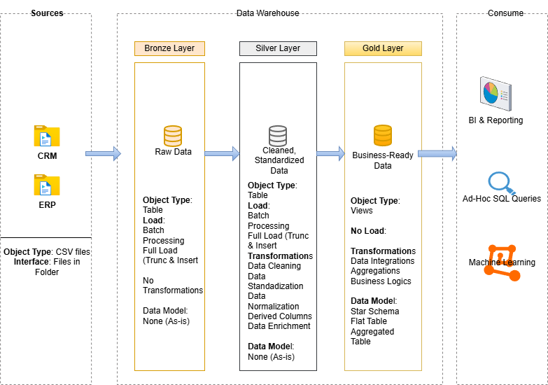

# sql-datawarehouse-project
Building a modern data warehouse with SQL Server, including ETL processes, data modelling and analytic

Data Architecture
The data architecture for this project follows Medallion Architecture Bronze, Silver, and Gold layers:
Bronze Layer: Stores raw data as-is from the source systems. Data is ingested from CSV Files into SQL Server Database.
Silver Layer: This layer includes data cleansing, standardization, and normalization processes to prepare data for analysis.
Gold Layer: Houses business-ready data modeled into a star schema required for reporting and analytic

Project Overview
This project involves:

Data Architecture: Designing a Modern Data Warehouse Using Medallion Architecture Bronze, Silver, and Gold layers.
ETL Pipelines: Extracting, transforming, and loading data from source systems into the warehouse.
Data Modeling: Developing fact and dimension tables optimized for analytical queries.
